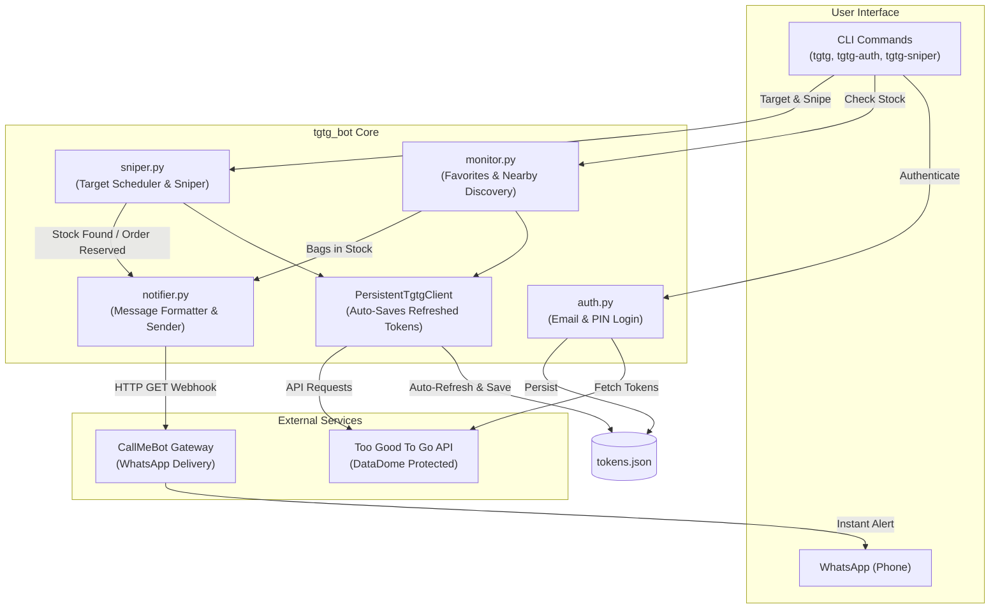

# Too Good To Go (TGTG) Bot, Sniper & WhatsApp Notifier

An intelligent automation tool for **Too Good To Go (TGTG)** that monitors favorite stores, discovers available surplus bags nearby, snipes scheduled drops with auto-reservation, and sends instant notifications to your phone via WhatsApp.

---

## Architecture & System Workflow



---

## Features & Implemented Plan

1. **Passwordless Authentication with Anti-Bot Alignment (`auth.py`)**:
   * Authenticates with Too Good To Go via email verification link or PIN code.
   * Matches mobile user-agent headers with DataDome SDK fingerprints to prevent interstitial CAPTCHAs.
   * Stores session tokens securely in `tokens.json`.

2. **Persistent Session Management (`PersistentTgtgClient`)**:
   * Automatically refreshes expired access tokens and cookies.
   * Silently persists updated tokens to disk on every refresh, keeping your session permanently active without manual re-logins.

3. **Stock Monitoring & Discovery (`monitor.py`)**:
   * **Favorites Mode**: Scans your saved favorite stores, calculates real item prices from minor units, and displays stock status.
   * **Nearby Discovery (`--nearby`)**: Discovers any available surplus bags in your area using coordinates (auto-derived from your saved favorites or set manually).

4. **Daily Sniper & Auto-Reserver (`sniper.py`)**:
   * Reads exact drop times (`next_sales_window_purchase_start`) directly from the store's schedule.
   * Displays an interactive startup menu showing upcoming drops and badges for stores with no scheduled drops.
   * Allows picking up to 3 bags to hunt for the day.
   * Automatically organizes targets in **chronological order** (earliest drop time first).
   * Sleeps with 0% CPU until 30 seconds before drop time, then initiates rapid checks with natural human-like jitter.
   * Automatically triggers `create_order` to **lock and reserve the bag** in your cart.
   * **Exits cleanly** as soon as one bag is secured.

5. **Instant WhatsApp Alerts (`notifier.py`)**:
   * Dispatches alerts via the CallMeBot gateway to your personal WhatsApp number.
   * Formats messages with item details, prices, and stock counts.

6. **Comprehensive Test Suite (`tests/`)**:
   * 46 unit and functional tests covering authentication, parsing, token persistence, notification delivery, and sniping logic.

---

## Technologies Applied

| Technology | Purpose |
|:---|:---|
| **Python 3.13+** | Core runtime environment. |
| **[uv](https://docs.astral.sh/uv/)** | Fast package management, script execution, and virtualenv tooling. |
| **[tgtg-python](https://github.com/ahivert/tgtg-python)** | Reverse-engineered client wrapper for the unofficial Too Good To Go API. |
| **Requests** | HTTP client for interacting with the CallMeBot notification API. |
| **python-dotenv** | Environment configuration management for credentials. |
| **pytest & unittest.mock** | Test suite ensuring reliability without making live API calls. |
| **CallMeBot API** | Outbound WhatsApp delivery service for personal mobile alerts. |

---

## Project Structure

```text
tgtg/
├── .env.example          # Template for environment variables
├── pyproject.toml        # Project dependencies, metadata & CLI entrypoints
├── tokens.json           # Cached authentication tokens (git-ignored)
├── tests/                # Test suite (46 tests)
│   ├── conftest.py       # Fixtures & mock payloads
│   ├── test_auth.py      # Authentication flow tests
│   ├── test_functional.py# End-to-end monitor workflow tests
│   ├── test_monitor.py   # Parsing, client retrieval & persistence tests
│   ├── test_notifier.py  # WhatsApp notification tests
│   └── test_sniper.py    # Chronological scheduling & reservation tests
└── src/
    └── tgtg_bot/
        ├── __init__.py
        ├── auth.py       # Passwordless login & token management
        ├── monitor.py    # Favorites check, nearby scanner & persistent client
        ├── notifier.py   # WhatsApp message formatting & delivery
        └── sniper.py     # Scheduled drop watcher & auto-reserver
```

---

## How to Use

### 1. Requirements & Setup

Install dependencies using `uv`:
```bash
uv sync
```

Copy the example environment file:
```bash
cp .env.example .env
```

---

### 2. Configure WhatsApp Alerts (CallMeBot)

To receive alerts on WhatsApp when bags become available:
1. Add the CallMeBot number **`+34 684 770 005`** to your phone contacts (or open the [CallMeBot WhatsApp link](https://wa.me/34684770005?text=I%20allow%20callmebot%20to%20send%20me%20messages)).
2. Send the message: `I allow callmebot to send me messages`
3. CallMeBot will reply with your personal `APIKEY`.
4. Add your phone number and API key to `.env`:
   ```env
   WHATSAPP_PHONE=+1234567890       # Your international phone number
   WHATSAPP_APIKEY=XXXXXX           # Your CallMeBot API key
   ```

---

### 3. Authenticate with Too Good To Go

Run the authentication script once:
```bash
uv run tgtg-auth
# or:
uv run python -m tgtg_bot.auth
```
* Enter your account email (or define `TGTG_EMAIL=your_email@example.com` in `.env`).
* Check your email for the login PIN or confirmation link.
* Once confirmed, credentials are saved to `tokens.json`.

---

### 4. Running the Monitor

#### Check Saved Favorites
```bash
uv run tgtg
# or:
uv run python -m tgtg_bot.monitor
```
Checks all favorite stores saved in your Too Good To Go mobile app. If any bags are in stock, it sends an instant WhatsApp alert.

#### Scan All Nearby Stores
```bash
uv run python -m tgtg_bot.monitor --nearby

# Optional: customize radius in km (default: 10km)
uv run python -m tgtg_bot.monitor --nearby --radius 15
```
Automatically centers on your area (derived from your saved favorites or custom coordinates) and scans all stores with bags currently in stock.

---

### 5. Running the Daily Sniper

To monitor drops and automatically reserve a bag:
```bash
uv run tgtg-sniper
# or:
uv run python -m tgtg_bot.sniper
```

* Shows your favorites and upcoming drop times.
* Prompts you to pick up to 3 bags for the day.
* Sorts your targets chronologically, sleeps until drop time, and rapidly checks during the drop window.
* Reserves the bag and notifies you on WhatsApp.
* **Closes automatically** once one bag is secured.

You can also pass target choices directly:
```bash
uv run tgtg-sniper --top 1,2,3
```

---

### 6. Running Tests

To run the complete test suite:
```bash
uv run pytest
```
